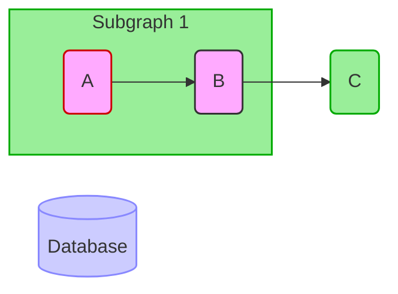

# Git and Ansible Tips & Tricks

Python expressions are valid in YAML playbook variable evaluations.

### Forking Git Repos and Syncing with the Upstream Repo

[Configuring A Fork](https://help.github.com/en/articles/configuring-a-remote-for-a-fork) describes how to add the upstream parent remote to my local fork.

Clone my fork to local and list remotes

```shell
$ git clone {git-server}/MY_ACCOUNT/MY_REPOSITORY.git
$ git remote -v
```

Add a new remote pointing to upstream source of my fork, then list remotes.

```shell
$ git remote add upstream {git-server}/ORIGINAL_OWNER/ORIGINAL_REPOSITORY.git
$ git remote -v
```

[Syncing A Fork](https://help.github.com/en/articles/syncing-a-fork) describes how to sync upstream commits into my fork.

```shell
$ git switch master                     # switch to master branch
$ git fetch upstream                    # fetch upstream to local
$ git merge upstream/master             # merge upstream into master
$ git push                              # push to my fork on github
```

### Accessing Dictionaries of Structured Data via Variables

This describes how to use the value of a variable as a key into a structured dictionary to extract values. The concept would be that the variable’s value would be passed into the playbook at run time. In Ansible Tower / AWX, a multiple choice survey can restrict selection to known values. For a more detailed example look at [server-specs.yml](https://github.com/walterrowe/ansible/blob/master/server-specs.yml)

```yaml
# virtual machine resource profiles
# structured data complex dictionary
#
# vm_spec['vm_small' ].cpu, .ram
# vm_spec['vm_medium'].cpu, .ram
# vm_spec['vm_large' ].cpu, .ram
#
# vm_size: vm_small
# vm_spec[vm_size].cpu, .ram

vm_spec:
  t2small:   { cpu:  1, ram:  2 }
  t2medium:  { cpu:  2, ram:  4 }
  t2large:   { cpu:  4, ram:  8 }
  t2xlarge:  { cpu:  8, ram: 16 }
  t2x2large: { cpu: 16, ram: 32 }

# guaranteed default value
vm_size: t2small

# create a list of keys for vm_spec dictionary
vm_keys: "{{ vm_spec.keys() | list }}"
```

Building on this you can test whether a value is in a list.

```yaml
tasks:
  fail: msg="Invalid VM size {{ vm_size }}"
  when: vm_size not in vm_keys
```

### Creating Dictionaries in Real-Time

There are times when you need to create structured data in real-time. This is useful in Ansible Tower workflows where upstream templates need to pass per-host information to downstream templates in the workflow. With the help from other online articles I figured out this solution.

```yaml
    - name: Create and Add items to dictionary
      set_stats:
        data:
          my_dict: "{{ my_dict | default({}) | combine ({ item.key : item.value }) }}"
      with_items:
        - { "key": "{{ inventory_hostname_short }}" , "value": {
              "var_a" : "{{ var_a_val }}",
              "var_b" : "{{ var_b_val }}",
              "var_c" : "{{ var_c_val }}"
            }
          }
```

This results in a dictionary that is passed back to ansible tower as an artifact. Downstream templates in the workflow will receive it in extra\_vars.

```yaml
my_dict:
  host1:
    var_a: "host1_var_a_val"
    var_b: "host1_var_b_val"
    var_c: "host1_var_c_val"
  host2:
    var_a: "host2_var_a_val"
    var_b: "host2_var_b_val"
    var_c: "host2_var_c_val"
  hostN:
    var_a: "host3_var_a_val"
    var_b: "host3_var_b_val"
    var_c: "host3_var_c_val"
```

Downstream templates can access this data as follows:

```yaml
my_dict[inventory_hostname_short].var_a
my_dict[inventory_hostname_short].var_b
my_dict[inventory_hostname_short].var_c
```

### String and Variable Operations

Strings in Ansible are strings in Python which are lists of characters. Lists can be concatenated using the "+" operating.

```yaml
var1: "one"
var2: "two"
var3: "three"
var4: "{{ var1 + var2 + var3 }}"
var5: "{{ var1 + ' for the money' }}"
```

The value of var4 is "onetwothree".
The value of var5 is "one for the money".

You can split strings with a delimiter.

```yaml
string: "this is a string"
{{ string.split }}            # yields "this", "is", "a", "string"
```

will split on the spaces by default and yield "this", "is", "a", "string".

```yaml
address: 192.168.100.10
{{ address.split('.') }}      # yields "192", "160", "100", "10"
```

You can split strings with a delimiter and select a specific items from the resulting list.

```yaml
address: 192.168.100.10
{{ address.split('.')[0] }}   # yields "192"
{{ address.split('.')[2] }}   # yields "100"
{{ address.split('.')[-1] }}  # yields "10"
```

And you can use splitext to split a filename on dot to get the basename.

```yaml
filename: basename.iso
{{ address | splitext }}	      # yields "basename"
```

You can extract a "substring" using list notation since strings are lists of characters. Remember that lists start with index 0. Substring extract would be specified by index of starting position, a colon, and the number of list items to extract.

```yaml
string: "onetwothree"
{{ string[0:3] }}      # yields "one"
{{ string[3:3] }}      # yields "two"
{{ string[6:5] }}      # yields "three"
{{ string[4:1] }}      # yields "w"
```

### Creating and Comparing Lists

This article [Adding strings to an array in Ansible](https://www.jeffgeerling.com/blog/2017/adding-strings-array-ansible) provides an example of how to build a list in a loop.

```yaml
---
- hosts: localhost
  gather_facts: no

  tasks:

    - name: Initialize an empty list for our strings
      set_fact:
        my_strings: []

    - name: Setup a string variable
      set_fact:
        my_name: "Max"

    - name: Append string to list
      set_fact:
        my_strings: "{{ my_strings + [ my_name ] }}"

    - debug: var=my_strings

    - name: Append another item to the list
      set_fact:
        my_strings: "{{ my_strings + [ 'Power' ] }}"

    - debug: var=my_strings
```

You can loop through multiple lists in parallel using "with_together". See [with_together.yml](https://github.com/walterrowe/ansible/blob/master/with_together.yml). The example below shows two lists and references them as item.0 and item.1. If you have more lists, reference them as item.3, item.4, etc.

```yaml
vms_list:[
  { name: vm1, os: redhat7, fs: general, size: vm_small },
  { name: vm2, os: redhat7, fs: web.   , size: vm_small },
  { name: vm3, os: redhat7, fs: oracle , size: vm_large }
]

mac_addr: [
  "00:00:00:00:00:00",
  "00:00:00:00:00:00",
  "00:00:00:00:00:00"
]

# 'with_together' syncs two lists into a common list
# [ (a,b) (1,2) ] becomes [ (a,1) (b,2) ]
# item.0 is first item in resulting list (even a list itself)
# item.1 is second item in resulting list (even a list itself)
#
# loop to display vm names, mac addresses
debug:
  msg: VM "{{ item.0.name }}" has MAC address is "{{ item.1 }}"
with_together:
  - "{{ vms_list }}"
  - "{{ mac_addr }}"
```

### Useful conditionals

Taken from Ansible Docs [Playbooks Conditionals](https://docs.ansible.com/ansible/latest/user_guide/playbooks_conditionals.html).

```yaml
when: (ansible_facts['distribution'] == "CentOS" or ansible_facts['distribution'] == "RedHat")
when: (ansible_facts['distribution'] == "Debian" or ansible_facts['distribution'] == "Ubuntu")
when: (ansible_facts['os_family'] == "RedHat" or ansible_facts['os_family'] == "Debian")
when: (ansible_facts['distribution'] == "RedHat" and ansible_facts['distribution_major_version'] == "7")
```

### Useful References and Examples

Read about Python strings to learn more about Ansible strings.

Read the [Ansible Variables](https://docs.ansible.com/ansible/latest/user_guide/playbooks_variables.html) doc for more info on variable references.

### Mermaid Diagrams


